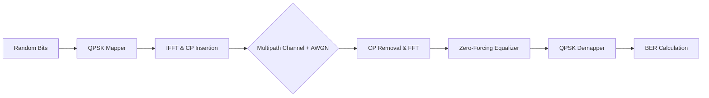
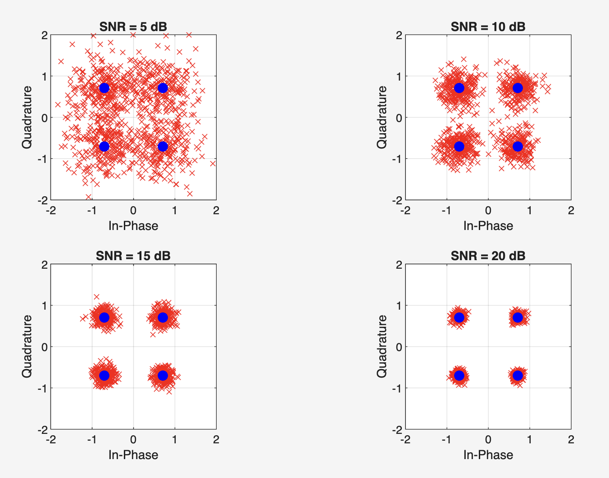

# End-to-End OFDM Wireless Link Simulation

 

## 📌 Project Overview
This project implements a complete **Orthogonal Frequency Division Multiplexing (OFDM)** transceiver system in MATLAB. It simulates the physical layer (PHY) processing chain used in modern wireless standards like **4G LTE and 5G NR**.

The simulation models a realistic wireless environment by introducing **Multipath Rayleigh Fading** and **Additive White Gaussian Noise (AWGN)**. It evaluates system performance by analyzing **Bit Error Rate (BER)** and **Constellation Diagrams** across varying Signal-to-Noise Ratios (SNR).

## 🚀 Key Features
* **OFDM Waveform Generation:** Implements IFFT/FFT-based subcarrier modulation with **64-point FFT**.
* **Inter-Symbol Interference (ISI) Mitigation:** Utilizes a **Cyclic Prefix (CP)** of 16 samples to preserve orthogonality in multipath channels.
* **Robust Channel Modeling:** Simulates a **frequency-selective fading channel** (4-tap Rayleigh model) combined with AWGN.
* **Receiver Algorithms:** Implements **Zero-Forcing (ZF) Frequency Domain Equalization (FDE)** to estimate and reverse channel distortion.
* **Performance Analysis:** Automates simulation loops across **5dB, 10dB, 15dB, and 20dB SNR** regimes to visualize constellation convergence.

## 🛠 System Architecture

The simulation follows a standard digital communication chain:

## 📊 Simulation Results

The simulation generates a 2x2 visualization of received symbol constellations at different noise levels.

### **Constellation Convergence Analysis**
* **SNR = 5 dB:** High noise and fading cause significant symbol scattering; BER is high (~0.1).
* **SNR = 20 dB:** The Zero-Forcing equalizer successfully inverts the channel effect. Received symbols (red) tightly cluster around the ideal QPSK constellation points (blue), indicating near-error-free transmission.

> *Example output showing the "cleanup" of the signal constellation as SNR increases*
